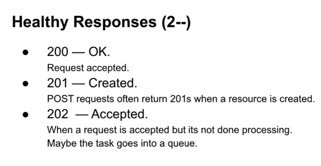
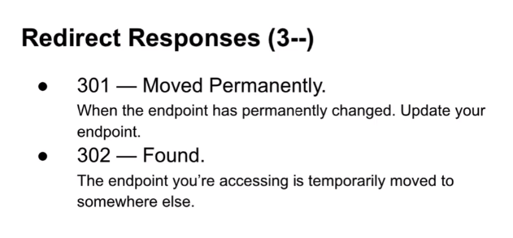
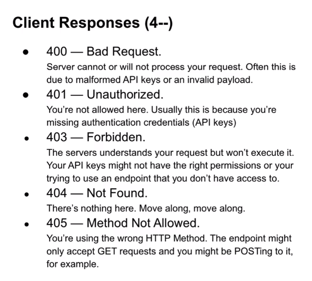
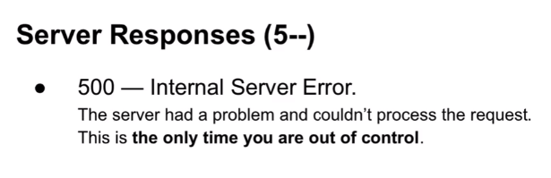

#### Configurations
- [ ] install : pip install djangorestframework
- [ ] create serializers.py:

#### serializers.py
- [ ] To use all fields, 
  - [ ] fields = '__all__'
- [ ] likes = serializers.RelatedField(many=True, read_only=True) will return str(likes): checkout: https://stackoverflow.com/questions/24346701/django-rest-framework-primarykeyrelatedfield
- [ ] set an attribute to the serializer, if you want to expand it.
```py
# serializers.py

from rest_framework import serializers
from .models import TweetModel

class TweetSerializer(serializers.ModelSerializer): # HyperlinkedModelSerializer allows to add a 'url' field which allows to add a link to the data.
    class Meta:
        model = TweetModel
        fields = ['id', 'content', 'likes']
        read_only_fields = ['id']
    
    def get_likes(self, obj):
        return obj.likes.count()

    def validate_content(self, value):
        if len(value)>MAX_TWEET_LENGTH:
            raise serializers.ValidationError("This tweet is too long")
        return value
    
```
- [ ] You can add custom fields with @property decorator in model class.
  - [ ] We don't need to create fields for the properties as class variables.
  - [ ] Just add them to fields list.
- [ ] To rename field name in json sent by serializer, add argument source='old_name'
  


#### views.py
- [ ] List of permissions
  - [ ] AnonymousUser (default)
  - [ ] AllowAny
  - [ ] IsAuthenticated
  - [ ] IsAdminUser
  - [ ] IsAuthenticatedOrReadOnly
>DjangoModelPermissions : Permissions set by adding users to groups and adding individual permissions.
  - [ ] DjangoModelPermissions
  - [ ] DjangoModelPermissionsOrAnonReadOnly
  - [ ] 
>Permissions can be added to class views by adding a attribute : permission_classes = [IsAdminUser]  # This is an example.
```py
# views.py
from rest_framework.response import Response
from rest_framework.decorators import api_view, permission_classes
from rest_framework.permissions import IsAuthenticated
from .serializer import TweetSerializer
from .model import TweetModel

@api_view(['POST']) # Only allows post request
@permission_classes([IsAuthenticated]) # This should be below of api_view, else it gives some internal error.
def tweet_create_view(request, *args, **kwargs):
    serializer = TweetSerializer(data=request.POST)
    if serializer.is_valid(raise_exception=True):
        serializer.save(user=request.user)
        return Response(serializer.data, status=201)
    return Response({}, status=400) # This is not needed because of raise_exception=True

@api_view(['GET'])
def tweet_list_view(request, *args, **kwargs):
    qs = TweetModel.objects.all()
    serializer = TweetSerializer(qs, many=True)
    return Response(serializer.data, status=200)


@api_view(['GET'])
def tweet_detail_view(request, tweet_id, *args, **kwargs):
    qs = TweetModel.objects.filter(id=tweet_id)
    if not qs.exists():
        return Response({'message':'Tweet not found'}, status=404)
    serializer = TweetSerializer(qs.first())
    return Response(serializer.data, status=200)

@api_view(['DELETE', 'POST'])
@permission_classes([IsAuthenticated])
def tweet_delete_view(request, tweet_id, *args, **kwargs):
    qs = TweetModel.objects.filter(id=tweet_id)
    if not qs.exists():
        return Response({'message':'Tweet not found', status=404})
    if not qs.filter
```
- [ ] To change the types of Authentication that give access to views, 
  - [ ] Create REST_FRAMEWORK dictionary with 'DEFAULT_AUTHENTICATION_CLASS':['list', 'of', 'classes', 'from', 'documentation']
  - [ ] Add permission_classes decorator and pass the list of permission classes from from rest_framework.permissions.
- [ ] To pass data from views to serializer, pass it as context in the constructor: `TweetSerializer(instance=obj, context={"request":request})` and access in class using self.context.

#### Class Views
- [ ] List of generic APIViews in rest_framework
  - [ ] CreateAPIView :
    - [ ] POST endpoint.
  - [ ] ListAPIView : 
    - [ ] GET endpoints for list of model instances.
  - [ ] RetrieveAPIView : 
    - [ ] GET endpoint for single model instance.
  - [ ] DestroyAPIView : 
    - [ ] DELETE endpoint for single instance.
  - [ ] UpdateAPIView : 
    - [ ] PUT-PATCH endpoint for single instance.
  - [ ] ListCreateAPIView : 
    - [ ] PUT-PATCH endpoint for list of model instances.
  - [ ] RetrieveUpdateAPIView : 
    - [ ] GET endpoint to view a model instance.
    - [ ] PUT-PATCH endpoint to update a model instance.
  - [ ] RetrieveDestroyAPIView : 
    - [ ] GET endpoint for single model instance.
    - [ ] DELETE endpoint for single model instance.
  - [ ] RetrieveUpdateDestroyAPIView :
    - [ ] GET endpoint for single model instance.
    - [ ] POST endpoint for single model instance.
    - [ ] DELETE endpoint for single model instance.
```py
from rest_framework import generics, permissions

class RecipeCreateView(generics.CreateAPIView):
  queryset = Recipe.objects.all()
  serializer_class = RecipeSerializer
  permission_classes = [
    permissions.IsAuthenticated,
  ]

  def perform_create(self, serializer):
    serializer.save(author=self.request.user)
    serializer_class = RecipeSerializer
    permission_classes = [permissions.AllowAny]
  
  # THERE IS ListAPIView ALSO !!!
  # THERE IS RetrieveAPIView ALSO !!!
  # THERE IS RetrieveUpdateDeleteAPIView ALSO !!!

class IngredientCreateView(generics.ListCreateAPIView):
  queryset = Ingredient.objects.all()
  serializer_class = Ingredient

class CreateUpvoteView(generics.CreateAPIView):
  serializer_class = UpvoteSerializer
  permission_classes = [permissions.IsAuthenticated]

  def get_queryset(self):
    user = self.request.user
    recipe = Recipe.objects.filter(pk=self.kwargs['pk'])
    return Upvote.objects.filter(user=user, recipe=recipe)
  
  def perform_create(self, serializer):
    if self.get_queryset().exists():
      raise ValidationError('You have already voted on the recipe.')
    user = self.request.user
    recipe = Recipe.objects.filter(pk=self.kwargs['pk']) # this 'pk' will be passed in url.
    serializer.save(user=user, recipe=recipe)

class RecipeUpdateView(generics.RetrieveUpdateDeleteView):
  queryset = Recipe.objects.all()
  serializer_class = RecipeSerializer
  permission_classes = [permissions.IsAuthenticated]

  def delete(self, request, *args, **kwargs):
    recipe = Recipe.objects.filter(author=self.request.user, pk=kwargs['pk'])
    if recipe.exists():
      return self.destroy(request, *args, **kwargs)
    raise ValidationError("This isn't your recipe")
    

```

```py
from rest_framework import viewsets
class CourseView(viewsets.ModelViewSet):
  queryset = Course.objects.all()
  serializer_class = CourseSerializer
```


#### settings.py
- [ ] add to INSTALLED_APPS : 'rest_framework'
```py
REST_FRAMEWORK = {
    'DEFAULT_AUTHENTICATION_CLASSES': [
        # 'rest_framework.authentication.BasicAuthentication',
        'rest_framework.authentication.SessionAuthentication',
    ],
    'DEFAULT_RENDERER_CLASSES': [
        'rest_framework.renderers.JSONRenderer',
        # 'rest_framework.renderers.BrowsableAPIRenderer',
    ]
}
```

### JS
- [ ] xhr.setRequestHeader('Content-Type', 'applications/json')
- [ ] CSRF javascript
  - [ ] 
  ```js
    function getCookie(name) {
        let cookieValue = null;
        if (document.cookie && document.cookie !== '') {
            const cookies = document.cookie.split(';');
            for (let i = 0; i < cookies.length; i++) {
                const cookie = cookies[i].trim();
                // Does this cookie string begin with the name we want?
                if (cookie.substring(0, name.length + 1) === (name + '=')) {
                    cookieValue = decodeURIComponent(cookie.substring(name.length + 1));
                    break;
                }
            }
        }
        return cookieValue;
    }
    const csrftoken = getCookie('csrftoken');
  ```
  - [ ] xhr.setRequestHeader('X-CSRFToken', csrftoken)


### Adding Like functionality
```py
# models.py
class TweetLikeModel(models.Model):
  user = models.ForeignKey(User, on_delete=CASCADE)
  tweet = models.ForeignKey('TweetModel', on_delete=CASCADE)
  timestamp = models.DateTimeField(auto_add_now=True)

class TweetModel(models.Model):
  likes = models.ManyToManyField(User, related_name='tweet_user', blank=True, through=TweetLike)

# If you don't need timestamp, you can remove through attribute and associate them directly.

# serializers.py
class TweetActionSerializer(serializers.Serializer):
  id = serializers.IntegerField()
  action = serializers.CharField()

  def validate_action(self, value):
    value = value.lower().strip()
    if not value in TWEET_ACTION_OPTIONS:
      raise serializers.ValidationError(f"Actions can only be: {*TWEET_ACTION_OPTIONS}")
    return value

# views.py
@api_view(['POST'])
@permission_classes([IsAuthenticated]) # see django_rest_framework.md to refer this.
def tweet_action_view(request, tweet_id, *args, **kwargs):
  qs = TweetModel.filter(id=tweet_id)
  if not qs.exists():
    return Response({'message', 'Tweet not found'}, status=404)
  
  serializer = TweetActionSerializer(obj)
  like, unlike, retweet = 'like', 'unlike', 'retweet'

  if serializer.is_valid(raise_exception=True):
    data = serializer.validated_data
    action = data.get('action')
    if action == like:
      obj.likes.add(request.user)
    elif action == unlike:
      obj.likes.remove(request.user)
    elif action == retweet:
      # Something needs to be done.
      pass
    else:
      assert False, 'Invalid action has been validated by TweetActionValidator !!!😈'
    return Response({'message':'Tweet action successful'}, status=200)
  return Response({'message':'Invalid Tweet'}, status=400)
  ...


# admin.py
class TweetLikeAdmin(admin.TabularInline):
  model = TweetLike

admin.site.register(TweetAdmin, TweetLikeAdmin)
```
- [ ] When using Content-Type: application/json, user request.data instead of request.POST.
- [ ] Logic for retweeting
  - [ ] Add a self linking ForeignKey in TweetModel called parent.
  - [ ] When someone retweets, create new tweet and its parent attribute to the original tweet.
  - [ ] Make the TweetSerializer readonly and copy original one to TweetCreateSerializer.
  ```py
    class TweetSerializer(serializers.ModelSerializer):
        likes = serializers.SerializerMethodField(read_only=True)
        content = serializers.SerializerMethodField(read_only=True)
        class Meta:
            model = TweetModel
            fields = ['id', 'content', 'likes']
        def get_likes(self, obj):
            return obj.likes.count()
    ```

### tests.py
- [ ] Create a user and add a tweet in it in setup function (from models itself).
- [ ] Refer ApiClient in django-rest-framework documentation -> testing.
- [ ] Eg:
```py
from django.urls import reverse
from rest_framework import status
from rest_framework.test import APITestCase
from blog.models import Post, Category
from django.contrib.auth.models import User

# assuming in urls.py, app_name='blog_api'
class PostTests(APITestCase):
  def test_view_posts(self):
    url = reverse('blog_api:listcreate')
    response = self.client.get(url, format='json')
    sefl.assertEqual(response.status_code, status.HTTP_200_OK)
  
  def create_post(self):
    self.test_category = Category.objects.create(name='django')
    self.testuser1 = User.objects.create_user(username='test_user1', password='123456789')

    data = {
      'title':'new',
      'author':1,
      'exerpt':'new',
      'content':'new',
    }
    url = reverse('blog_api:listcreate')
    response = self.client.post(url, data, format='json')
    self.assertEqual(response.status_code, 201)

```

### urls.py
- [ ] Adding swagger:
  - [ ] pip install drf-yasg.
```py
from drf_yasg.views import get_schema_view
from drf_yasg import openapi

schema_view = get_schema_view(
   openapi.Info(
      title="APIs by Manas Mishra 😎",
      default_version='OSSUM',
      description="A simple api to add, remove and update Questions.",
    #   terms_of_service="https://www.google.com/policies/terms/",
    #   contact=openapi.Contact(email="Manas Mishra 😎"),
    #   license=openapi.License(name="BSD License"),
   ),
   public=True,
   permission_classes=(permissions.AllowAny,),
)

urlpatterns = [
    path('', schema_view.with_ui('swagger', cache_timeout=0), name='schema-swagger-ui'),
]

```
- [ ] Another way to add api endpoints.
```py
from rest_framework import routers
router.register('courses', CourseView) # CourseView imported from .views

urlpatterns = [
  path('', include(router.urls)),
]
```

#### settings.py
- [ ] To add api access to other applications, we need to configure CORS policies.
- [ ] To install, view django-cors-header in pypi.
- [ ] To know about configuration options, refer its github repo: https://github.com/adamchainz/django-cors-headers
  ```py
  CORS_ORIGIN_ALLOW_ALL = True # Any website has access to api.
  # specific websites can be assigned as a list (http and https need to be added separately)
  CORS_URLS_REGEX = r'^/api/.*$'
  ```

## TO enable automatic authentication in dev environment.
- [ ] Create rest_api directory inside project (where settings.py exists).
  - [ ] Create an __init__.py file inside that to make it a module.
  - [ ] Create another file dev.py # Delete this file when in production.
    - [ ] 
    ```py
    from rest_framework import authentication
    from django.contrib.auth import get_user_model
    User = get_user_model()
    class DevAuthentication(authentication.BasicAuthentication):
      def authenticate(self, request):
        qs = User.objects.all()
        user = qs.order_by("?").first()
        return (user, None) # usually it returns (user, auth)
    ```
- [ ] In settings.py
  ```py
    if DEBUG:
      DEFAULT_AUTHENTICATION_CLASSES += ['tweetme2.rest_api.dev.DevAuthentication']
  ```

## Pagination
- [ ] Look at django-rest-framework pagination.
- [ ] There are many types of inbuilt pagination-classes and you can create your own custom ones.
- [ ] Eg:
```py
# views.py
from rest_framework.pagination import PageNumberPagination
@api_view(['GET'])
@permission_classes([IsAuthenticated])
def tweet_feed_view(request, *args, **kwargs):
  paginator = PageNumberPagination()
  paginator.page_size = 20
  user = request.user
  qs = Tweet.objects.feed(user)
  paginated_qs = paginator.paginate(qs, request)
  serializer = TweetSerializer(paginated_qs, many=True)
  return paginator.get_paginated_response(serializer.data)
```

## Custom Serializers
```py
class ProfileSerializer(serializers.ModelSerializer):
  first_name = serializers.SerializerMethodField(read_only=True)
  last_name = serializers.SerializerMethodField(read_only=True)
  username = serializers.SerializerMethodField(read_only=True)
  follower_count = serializers.SerializerMethodField(read_only=True)
  following_count = serializers.SerializerMethodField(read_only=True)

  class Meta:
    model = Profile
    fields = [
      'first_name',
      'last_name',
      'follower_count',
      'following_count',
      'username',
      'id',
    ]

    def get_first_name(self, obj):
      return obj.user.first_name

    def get_last_name(self, obj):
      return obj.user.last_name

    def get_username(self, obj):
      return obj.user.username

    def get_following_count(self, obj):
      return obj.user.following.count()

    def get_followers_count(self, obj):
      return obj.user.followers.count()

```

## REST Authentication
- [ ] In urls.py : path('api-auth/', include('rest_framework.urls', namespace='rest_framework'))
- [ ] Another method:
#### serializers.py
```py
class UserRegistrationSerializer(serializers.ModelSerializer):
  password = serializers.CharField(style={'input type':'password'}, write_only=True)
  class Meta:
    model = User
    fields = ['username', 'email', 'password']
  
  def create(self, validated_data):
    user = User.objects.create(username=validated_data['username'], email=validated_data['email'])
    user.set_password(validated_data['password'])
    user.save()
    return user

# Then create CreateAPIView.
```

### Token based authentication
- [ ] User state is stored on client-side rather server side. It is much more scalable.
##### settings.py
```py
# In INSTALLED_APPS, add 
# 'rest_framework.authtoken'

REST_FRAMEWORK = {
  'DEFAULT_AUTHENTICATION_CLASSES': [
    'rest_framework.authentication.TokenAuthentication'
  ]
}
```
##### models.py
```py
from django.db.models.signals import post_save
from django.dispatch import receiver
from rest_framework.authtoken.models import Token

...

@receiver(post_save, sender=User)
def create_token(sender, instance=None, created=False, **kwargs):
  if created:
    Token.objects.create(user=instance)

```
- [ ] To create token for the admin user, `./manage.py drf_create_token [username]`

##### views.py
```py
from rest_framework.authtoken.serializers import AuthTokenSerializer
from rest_framework.authtoken.views import ObtainAuthToken

class UserRegistrationView(generics.CreateAPIView):
  queryset = User.objects.all()
  serializer_class = UserRegistrationSerializer
  permission_classes = [permissions.AllowAny]

  def post(self, request, *args, **kwargs):
    serializer = UserRegistrationSerializer(data=request.data)
    if serializer.is_valid():
      user = serializer.save()
      token = Token.objects.get(user=user).key
      data = {'token':token}
    else:
      data = serializers.errors
    return Response(data=data, status=201)
  
class UserLoginView(generics.CreateAPIView):
  serializer_class = AuthTokenSerializer

  def create(self, request):
    return ObtainAuthToken().post(request)

```
- [ ] To Authenticate, setRequestHeader('Authentication', 'Token [User's token]')

### Creating Custom Permissions
- [ ] Eg of permission of person who created a post can only edit it.
- [ ] rest_framework.permissions.SAFE_METHODS is list of 'GET', 'HEAD' and 'OPTION' methods.
```py
from rest_framework import permissions
class PostUserWritePermission(permissions.BasePermission):
  message = 'Editing posts is restricted to the author only.'

  def has_object_permission(self, request, view, obj):
    if request.method in permissions.SAFE_METHODS:
      return true
    return request.user == obj.author
```

### Some Notes
- [ ] Always use request.data for a post request.

### HTTP Response Codes
  
  
  
  


### REST(ful) meaning
Standards for and api.
- [ ] Base url : http://something.com/api/
- [ ] HTTP Methods : GET, POST, PUT, PATCH, DELETE
- [ ] Is stateless, like http ???
- [ ] Includes media type like JSON.

## Testing
- [ ] Refer coverage in the try_django.md
- [ ] Setting up
```py
from rest_framework.test import APITestCase
from django.urls import reverse

from django.contrib.auth.models import User
from blog.models import Post, Category

class PostTests(APITestCase):
  def test_view_posts(self):
    url = reverse('blog_api:listcreate') # blog_api must be defined as app_name in urls.py
    response = self.client.get(url, format='json')
    self.assertEqual(response.status_code, 200)
    
```

## Setup Google Authentication
- [ ] https://medium.com/@gerrysabar/implementing-google-login-with-jwt-in-django-for-restful-api-authentication-eaa92e50522d
