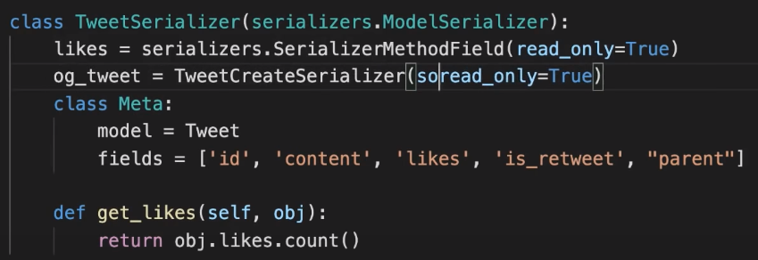

#### Configurations
- [ ] install : pip install djangorestframework
- [ ] create serializers.py:

#### serializers.py
```py
# serializers.py

from rest_framework import serializers
from .models import TweetModel

class TweetSerializer(serializers.ModelSerializer):
    class Meta:
        model = TweetModel
        fields = ['id', 'content', 'likes']
    
    def get_likes(self, obj):
        return obj.likes.count()

    def validate_content(self, value):
        if len(value)>MAX_TWEET_LENGTH:
            raise serializers.ValidationError("This tweet is too long")
        return value
    
```
- [ ] You can add custom fields with @property decorator in model class.
  - [ ] We don't need to create fields for the properties as class variables.
  - [ ] Just add them to fields list.
- [ ] To rename field name in json sent by serializer, add argument source='old_name'
  


#### views.py
```py
# views.py
from rest_framework.response import Response
from rest_framework.decorators import api_view, permission_classes
from rest_framework.permissions import IsAuthenticated
from .serializer import TweetSerializer
from .model import TweetModel

@api_view(['POST']) # Only allows post request
@permission_classes([IsAuthenticated]) # This should be below of api_view, else it gives some internal error.
def tweet_create_view(request, *args, **kwargs):
    serializer = TweetSerializer(data=request.POST)
    if serializer.is_valid(raise_exception=True):
        serializer.save(user=request.user)
        return Response(serializer.data, status=201)
    return Response({}, status=400) # This is not needed because of raise_exception=True

@api_view(['GET'])
def tweet_list_view(request, *args, **kwargs):
    qs = TweetModel.objects.all()
    serializer = TweetSerializer(qs, many=True)
    return Response(serializer.data, status=200)


@api_view(['GET'])
def tweet_detail_view(request, tweet_id, *args, **kwargs):
    qs = TweetModel.objects.filter(id=tweet_id)
    if not qs.exists():
        return Response({'message':'Tweet not found'}, status=404)
    serializer = TweetSerializer(qs.first())
    return Response(serializer.data, status=200)

@api_view(['DELETE', 'POST'])
@permission_classes([IsAuthenticated])
def tweet_delete_view(request, tweet_id, *args, **kwargs):
    qs = TweetModel.objects.filter(id=tweet_id)
    if not qs.exists():
        return Response({'message':'Tweet not found', status=404})
    if not qs.filter
```
- [ ] To change the types of Authentication that give access to views, 
  - [ ] Create REST_FRAMEWORK dictionary with 'DEFAULT_AUTHENTICATION_CLASS':['list', 'of', 'classes', 'from', 'documentation']
  - [ ] Add permission_classes decorator and pass the list of permission classes from from rest_framework.permissions.

#### settings.py
- [ ] add to INSTALLED_APPS : 'rest_framework'
```py
REST_FRAMEWORK = {
    'DEFAULT_AUTHENTICATION_CLASSES': [
        # 'rest_framework.authentication.BasicAuthentication',
        'rest_framework.authentication.SessionAuthentication',
    ],
    'DEFAULT_RENDERER_CLASSES': [
        'rest_framework.renderers.JSONRenderer',
        # 'rest_framework.renderers.BrowsableAPIRenderer',
    ]
}
```

### JS
- [ ] xhr.setRequestHeader('Content-Type', 'applications/json')
- [ ] CSRF javascript
  - [ ] 
  ```js
    function getCookie(name) {
        let cookieValue = null;
        if (document.cookie && document.cookie !== '') {
            const cookies = document.cookie.split(';');
            for (let i = 0; i < cookies.length; i++) {
                const cookie = cookies[i].trim();
                // Does this cookie string begin with the name we want?
                if (cookie.substring(0, name.length + 1) === (name + '=')) {
                    cookieValue = decodeURIComponent(cookie.substring(name.length + 1));
                    break;
                }
            }
        }
        return cookieValue;
    }
    const csrftoken = getCookie('csrftoken');
  ```
  - [ ] xhr.setRequestHeader('X-CSRFToken', csrftoken)


### Adding Like functionality
```py
# models.py
class TweetLikeModel(models.Model):
  user = models.ForeignKey(User, on_delete=CASCADE)
  tweet = models.ForeignKey('TweetModel', on_delete=CASCADE)
  timestamp = models.DateTimeField(auto_add_now=True)

class TweetModel(models.Model):
  likes = models.ManyToManyField(User, related_name='tweet_user', blank=True, through=TweetLike)

# If you don't need timestamp, you can remove through attribute and associate them directly.

# serializers.py
class TweetActionSerializer(serializers.Serializer):
  id = serializers.IntegerField()
  action = serializers.CharField()

  def validate_action(self, value):
    value = value.lower().strip()
    if not value in TWEET_ACTION_OPTIONS:
      raise serializers.ValidationError(f"Actions can only be: {*TWEET_ACTION_OPTIONS}")
    return value

# views.py
@api_view(['POST'])
@permission_classes([IsAuthenticated]) # see django_rest_framework.md to refer this.
def tweet_action_view(request, tweet_id, *args, **kwargs):
  qs = TweetModel.filter(id=tweet_id)
  if not qs.exists():
    return Response({'message', 'Tweet not found'}, status=404)
  
  serializer = TweetActionSerializer(obj)
  like, unlike, retweet = 'like', 'unlike', 'retweet'

  if serializer.is_valid(raise_exception=True):
    data = serializer.validated_data
    action = data.get('action')
    if action == like:
      obj.likes.add(request.user)
    elif action == unlike:
      obj.likes.remove(request.user)
    elif action == retweet:
      # Something needs to be done.
      pass
    else:
      assert False, 'Invalid action has been validated by TweetActionValidator !!!😈'
    return Response({'message':'Tweet action successful'}, status=200)
  return Response({'message':'Invalid Tweet'}, status=400)
  ...


# admin.py
class TweetLikeAdmin(admin.TabularInline):
  model = TweetLike

admin.site.register(TweetAdmin, TweetLikeAdmin)
```
- [ ] When using Content-Type: application/json, user request.data instead of request.POST.
- [ ] Logic for retweeting
  - [ ] Add a self linking ForeignKey in TweetModel called parent.
  - [ ] When someone retweets, create new tweet and its parent attribute to the original tweet.
  - [ ] Make the TweetSerializer readonly and copy original one to TweetCreateSerializer.
  ```py
    class TweetSerializer(serializers.ModelSerializer):
        likes = serializers.SerializerMethodField(read_only=True)
        content = serializers.SerializerMethodField(read_only=True)
        class Meta:
            model = TweetModel
            fields = ['id', 'content', 'likes']
        def get_likes(self, obj):
            return obj.likes.count()
    ```

### tests.py
- [ ] Create a user and add a tweet in it in setup function (from models itself).
- [ ] Refer ApiClient in django-rest-framework documentation -> testing.

#### settings.py
- [ ] To add api access to other applications, we need to configure CORS policies.
- [ ] To install, view django-cors-header in pypi.
- [ ] To know about configuration options, refer its github repo: https://github.com/adamchainz/django-cors-headers
  ```py
  CORS_ORIGIN_ALLOW_ALL = True # Any website has access to api.
  # specific websites can be assigned as a list (http and https need to be added separately)
  CORS_URLS_REGEX = r'^/api/.*$'
  ```

## TO enable automatic authentication in dev environment.
- [ ] Create rest_api directory inside project (where settings.py exists).
  - [ ] Create an __init__.py file inside that to make it a module.
  - [ ] Create another file dev.py # Delete this file when in production.
    - [ ] 
    ```py
    from rest_framework import authentication
    from django.contrib.auth import get_user_model
    User = get_user_model()
    class DevAuthentication(authentication.BasicAuthentication):
      def authenticate(self, request):
        qs = User.objects.all()
        user = qs.order_by("?").first()
        return (user, None) # usually it returns (user, auth)
    ```
- [ ] In settings.py
  ```py
    if DEBUG:
      DEFAULT_AUTHENTICATION_CLASSES += ['tweetme2.rest_api.dev.DevAuthentication']
  ```